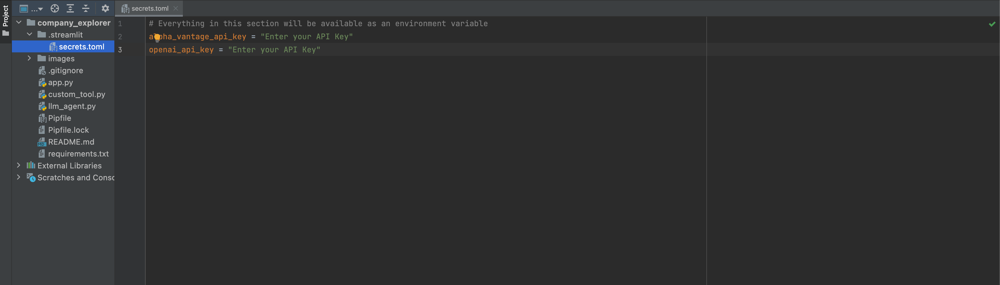
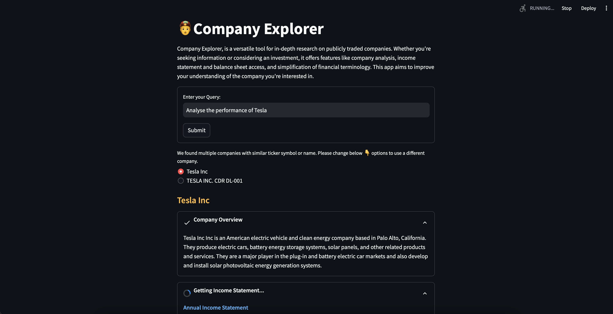

## Company Explorer
Introducing Company Explorer, the revolutionary company research app powered by **Streamlit**, **LangChain** and **Gen AI**.


Company Explorer, is a versatile tool for in-depth research on publicly traded companies. Whether you're seeking information or considering an investment, it offers features like company analysis, income statement and balance sheet access, and simplification of financial terminology.
This app aims to improve your understanding of the company you're interested in.

Some Key features Company Explorer include:
* Analyzing company results.
* Providing information about income statements and balance sheets.
* Translating financial jargon into an easily understandable format.
* Enhancing understanding of a chosen company through an app.

Overall, the Company Explorer app aims to simplify the process of exploring the performance of any company.

**Video demonstration (click the picture):**

[](https://youtu.be/P30QUiCsvRI)

### Built With

- [Streamlit: 1.26.0 ](https://docs.streamlit.io/)
- [Python : 3.9 ](https://www.python.org/)
- [Pandas : 2.1.0 ](https://pandas.pydata.org/)
- [Numpy : 1.25.2](https://numpy.org/)
- [LangChain](https://python.langchain.com/docs/get_started/introduction.html)
- [ChatGPT](https://openai.com/blog/chatgpt)


## Getting Started

### Prerequisites

- Python
- [Pipenv](https://pypi.org/project/pipenv/)
- [OPEN_API_KEY](https://help.openai.com/en/articles/4936850-where-do-i-find-my-secret-api-key)
- [ALPHA VANTAGE API_KEY](https://www.alphavantage.co/)


### Installation

- Clone the repository

  ```
  git clone https://github.com/sumanentc/company-explorer.git
  ```

- Using Streamlit app locally

1. Install dependencies

  ```
  pipenv shell

  pipenv install
  ```
2. Update the API KEY

* Add a file called `secrets.toml` inside .streamlit folder.
* Add the below Env variables.
```
alpha_vantage_api_key = "Enter your valid API Key"
openai_api_key = "Enter your valid API Key"
```


3. Run the Streamlit App

  ```  
  streamlit run app.py

  ```

4. Start asking questions on the Streamlit App

* Streamlit app started locally at below port:
```
http://localhost:8501
```



## License

Distributed under the Apache License. See `LICENSE` for more information.

## References

https://www.alphavantage.co/documentation/

https://docs.streamlit.io/knowledge-base/using-streamlit/how-do-i-run-my-streamlit-script

https://python.langchain.com/docs/modules/agents/how_to/custom_agent


